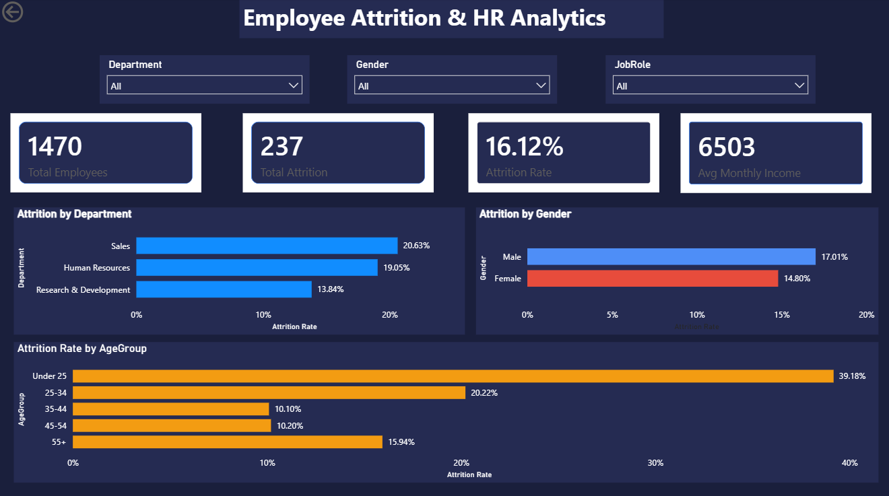
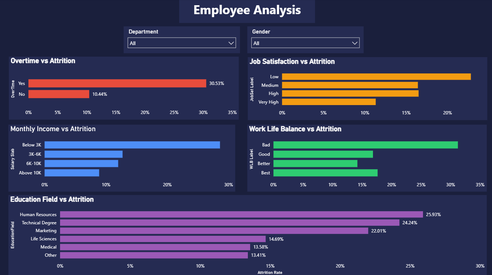
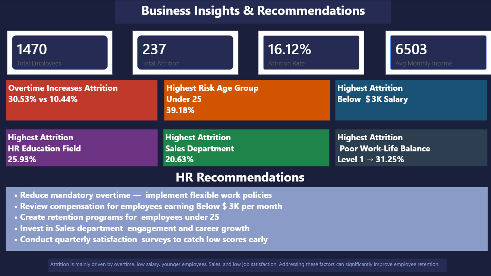

# HR Analytics Dashboard

## Project Overview

This project is an interactive HR Analytics Dashboard built using Power BI, MySQL, SQL, and Excel. It helps analyze employee attrition and identify key factors affecting employee retention through interactive dashboards and business insights.

---

## Tech Stack

- Power BI
- MySQL
- SQL
- Microsoft Excel
- Power Query
- DAX

---

## Dataset

- Total Employees: 1470
- Total Attrition: 237
- Attrition Rate: 16.12%
- Average Monthly Income: 6,503

---

## Dashboard Pages

### 1. Overview
- Department-wise Attrition
- Gender-wise Attrition
- Age Group Analysis
- KPI Cards

### 2. Employee Analysis
- Overtime vs Attrition
- Job Satisfaction vs Attrition
- Monthly Income vs Attrition
- Work-Life Balance vs Attrition
- Education Field Analysis

### 3. Business Insights
- Business Recommendations
- HR Actionable Insights
- Key Attrition Drivers

---

## Key Insights

- Employees working overtime have 30.53% attrition.
- Employees below 25 years have the highest attrition (39.18%).
- Employees earning below $3K per month leave most frequently.
- Human Resources has the highest education field attrition.
- Sales department has the highest department attrition.
- Low job satisfaction strongly impacts employee retention.

---

## Repository Structure

```
HR-Analytics-Dashboard
│
├── dashboard
├── dataset
├── screenshots
├── sql
├── README.md
├── LICENSE
```

---

## Dashboard Preview

### Overview



### Employee Analysis



### Business Insights



---

## Author

**Gouri Mundada**

Engineering Student | Data Analytics | Power BI | SQL | MySQL
